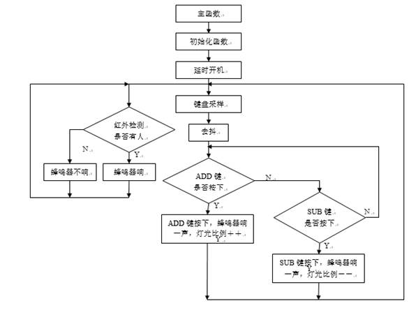

# Intelligent-dimming-lamp
# 智能调光台灯

## 一、设计目的与意义

​	随着社会的进步发展，家用电器的节能、环保受到了人们的日益关注。照明是现代生活必不可少的一部分。据统计，2017年我国全社会的用电量约6.3万亿度。而照明用电量约占全社会用电量的13%，巨大的照明用电量产生很大的能源损耗。由于忘记关灯或者灯光亮度无法随着环境亮度变化导致的过度照明，也带来很大的电能浪费。

​	本文以LED台灯照明节能、健康为目标，提出了智能LED台灯的设计方案。除了可以通过手动调节台灯亮度以外，还可以通过传感器检测人体信号，及时纠正使用者坐姿不对的问题，避免过度照明和台灯使用者的不健康使用问题。使用方便、简单、可靠性好，成本较低。

 

## 二、自检子程序流程框图

 蜂鸣器自检：

 键盘自检：

 数码管自检：

 

## 三、设计任务分析

1、任务内容解析

在系统软件设计初始，对系统上电后的初始工作模式为手动模式，在系统上电后，按下开关，L E D 灯点亮，通过按键可以使灯的亮度发生改变，则手动模式能够正常使用，测试成功。

（1）红外测距传感器模块测试

在测试前，先将红外测距传感器的感应距离调整到一个合适的距离，便于系统测试。对系统上电，测试人员靠近系统，当人与传感器距离小于原先设定的距离时，蜂鸣器响；远离后，蜂鸣器不响，模块测试成功。

（2）LED 照明模块测试在系统上电后，手按动键盘模块，LED灯的亮度随着键盘按键的变化而变化，按键盘“+”，光的亮度增加；按键盘“-”，光的亮度减弱。

在上述对系统模式的测试中，系统的工作正常，完成了预期的目标。当使用者的身体太靠近桌面时，台灯自动感应，蜂鸣器发声，提醒改正坐姿。台灯灯光的亮度不随外界环境光强变化而变化，可以手动按下调节亮度按键来调节灯光亮度。红外测距传感器的距离是20cm 左右（距离可调），这样的设计是为了提醒使用者学习过程中的坐姿不当，预防近视。

 

2、设计思路

（1）自检

​	蜂鸣器：我们通过使蜂鸣器有不同频率的响停，判断蜂鸣器是否可以正常工作；

​	数码管：编写数码管显示0-9的代码，建立表，循环显示数值，此过程中，通过段选和位选，判断数码管是否可以正常工作；

​	键盘：通过K1-K4四个键盘按键控制第一位数码管显示不同的数字，从而检测出键盘是否正常；

​	LED：我们通过使LED亮灭不同的时间，判断其工作是否正常。

（2）实现功能

​	当使用者的身体太靠近桌面时，台灯自动感应，蜂鸣器发声，提醒改正坐姿。手动按下调节亮度按键来调节灯光亮度。

3、程序流程框图（一级框图、二级框图）

 

 

 